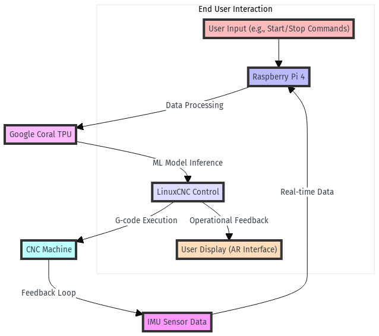

# 🤖 CNC AI-enhanced Control System

This repository houses an innovative system designed to enhance CNC machine operations through real-time conversion of sensor data into G-code, augmented by unsupervised machine learning for optimizing performance and safety. It employs an ecosystem of hardware and software components, including IMU sensors, Raspberry Pi 4, Google Coral TPU for ML inference, and a safety-first approach.

---

## 📚 Table of Contents

- [🔩 Hardware Requirements](#-hardware-requirements)
- [💾 Software Requirements](#-software-requirements)
- [🛠️ Setup and Configuration](#-setup-and-configuration)
- [📈 System Architecture and Data Flow](#-system-architecture-and-data-flow)
- [📈 Unsupervised Machine Learning Model](#-unsupervised-machine-learning-model)
- [🔰 Safety Precautions and Collision Avoidance](#-safety-precautions-and-collision-avoidance)
- [🚀 Future Development](#-future-development)
- [🎯 Goals](#-goals)
- [🌟 Getting Started](#-getting-started)
- [💡 Contributing](#-contributing)
- [📄 License](#-license)
- [📬 Contact](#-contact)

---

## 🔩 Hardware Requirements

- Inertial Measurement Unit (IMU): Custom or High Precision Models
- Raspberry Pi 4
- Google Coral TPU
- CNC machine compatible with LinuxCNC or similar controllers

---

## 💾 Software Requirements

- TensorFlow Lite for ML model deployment
- LinuxCNC for CNC machine control and integration
- Custom software for real-time data processing and ML inference

---

## 🛠️ Setup and Configuration

1. Configure the Raspberry Pi 4 with Linux and install necessary drivers for Coral TPU.
2. Set up Google Coral with TensorFlow Lite and deploy the pre-trained unsupervised learning model.
3. Integrate IMU sensors with Raspberry Pi for real-time data collection.
4. Install and configure LinuxCNC on the CNC machine, ensuring compatibility with the Raspberry Pi system.

---

## 📈 System Architecture and Data Flow

This section outlines the architecture of the CNC AI-enhanced Control System and the flow of data between its components. The following diagram provides a visual representation of the system's operation:

---

## 📈 Unsupervised Machine Learning Model

- Developed to optimize CNC operations by learning from sensor data.
- Focuses on real-time adaptation, performance optimization, and collision avoidance.
- Continuously improves through unsupervised learning from new data.

---

## 🔰 Safety Precautions and Collision Avoidance

- Implements machine learning algorithms for predicting and avoiding collisions in real-time.
- Utilizes sensor data to dynamically adjust operations based on current conditions and learned patterns.

---

## 🚀 Future Development

- Expand machine learning capabilities to cover more complex scenarios and materials.
- Enhance real-time data processing for faster response times.
- Explore integration with augmented reality for improved operational visibility and control.

---

## 🎯 Goals

- ✅ Implement real-time conversion of sensor data to G-code.
- ✅ Deploy unsupervised machine learning model on Google Coral TPU.
- ✅ Integrate system with CNC machine for live operation.
- 🔄 Develop advanced safety mechanisms based on AI predictions.
- 🔄 Implement augmented reality interface for enhanced user interaction.

---

## 🌟 Getting Started

To contribute or get started with this project:

1. Clone this repository to your local machine.
2. Follow the setup and configuration instructions to prepare your hardware.
3. Review the documentation and code comments for an overview of the system architecture and operation.
4. Experiment with the system using your CNC machine and observe the enhancements in operation and safety.

---

## 💡 Contributing

Contributions are welcome! To contribute:

1. Fork the repository.
2. Create a new branch for your feature or fix.
3. Submit a pull request with a comprehensive description of changes.

---

## 📄 License

This project is licensed under the MIT License - see the LICENSE file for details.

---

## 📬 Contact

For inquiries or contributions, please contact us at [project_email@example.com](mailto:project_email@example.com).

---
